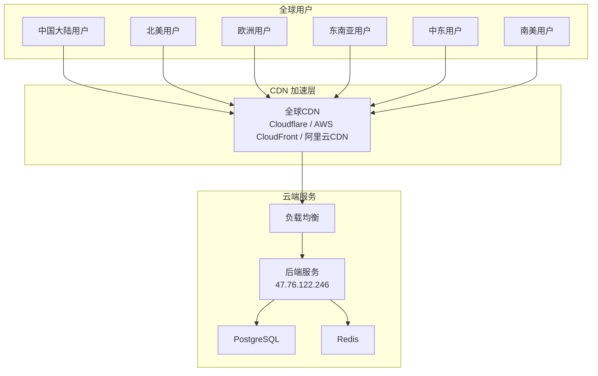

# TokenHub 全球化部署与 CDN 加速指南

## 全球用户访问架构

TokenHub 设计为**全球可用**的 SaaS 平台，支持国内外用户自由访问。

### 1. 推荐部署架构



### 2. CDN 配置

#### 2.1 推荐使用 Cloudflare（全球加速最佳）

```bash
# DNS 配置
# 类型: CNAME / A
# 名称: api.tokenshopai.com / tokenshopai.com
# 目标: 47.76.122.246
# 代理状态: Proxied (CDN 加速)
```

**Cloudflare 优点**:
- 全球 330+ 节点
- 内置 DDoS 防护
- 自动 SSL/TLS
- HTTP/2 & HTTP/3 支持
- 中国大陆通过合作伙伴网络接入

#### 2.2 中国大陆用户推荐

```bash
# 阿里云 CDN + ECS 同区域回源
# 前端: 阿里云 CDN (OSS + CDN)
# 后端: 直接连接 ECS API

# 腾讯云 CDN 方案
# 前端 CDN 域名: cdn.tokenshopai.com
# 源站: 当前 ECS 服务器
```

### 3. 前端 CDN 配置（当前项目）

当前前端使用 **Hash 路由**（`createWebHashHistory`），静态文件通过 CDN 分发即可。

#### Nginx CDN 配置示例

```nginx
# /frontend/nginx.conf 已包含以下优化:
# - 静态资源缓存 30天 (js, css, png, jpg, svg)
# - SPA 路由支持
# - API 代理至后端
# - SSE 流式传输支持
```

### 4. 多区域部署方案（高级）

当需要更低延迟时，采用多地部署：

```yaml
# docker-compose 全球多区域部署
# 区域 1: 中国大陆 (阿里云 / 腾讯云)
# 区域 2: 东南亚 (AWS Singapore)
# 区域 3: 北美 (AWS US East)
# 区域 4: 欧洲 (AWS Frankfurt)

# 使用全局负载均衡 (GSLB) 进行智能 DNS 解析
```

### 5. 性能优化建议

| 优化项 | 实施 |
|--------|------|
| 前端文件 CDN 加速 | HTML/JS/CSS 通过 CDN 分发 |
| API 请求压缩 | 启用 Gzip/Brotli |
| 数据库连接池 | 已配置 MaxOpenConns/MaxIdleConns |
| Redis 缓存 | 已配置 Session/验证码缓存 |
| 静态资源缓存 | 30 天浏览器缓存 |
| HTTP/2 支持 | 配置 nginx 启用 |
| SSL 证书 | Let's Encrypt / Cloudflare SSL |

### 6. 当前服务状态

- **服务器 IP**: 47.76.122.246
- **API 地址**: http://47.76.122.246:8080
- **健康检查**: [http://47.76.122.246:8080/health](http://47.76.122.246:8080/health)
- **部署模式**: Docker (建议) / 裸机部署
- **SSL 配置**: 建议通过 Cloudflare 或 nginx + Let's Encrypt 配置

### 7. 语言支持

当前系统支持 **18 种语言**：

| 语言 | 代码 | 覆盖区域 |
|------|------|----------|
| 简体中文 | zh-CN | 中国大陆 |
| 繁體中文 | zh-TW | 台湾、香港、澳门 |
| English | en-US | 全球通用 |
| 日本語 | ja-JP | 日本 |
| 한국어 | ko-KR | 韩国 |
| Français | fr-FR | 法国、加拿大、非洲 |
| Deutsch | de-DE | 德国、奥地利、瑞士 |
| Español | es-ES | 西班牙、拉丁美洲 |
| Português | pt-BR | 巴西、葡萄牙 |
| Italiano | it-IT | 意大利 |
| Русский | ru-RU | 俄罗斯、独联体 |
| العربية | ar-SA | 中东、北非 |
| हिन्दी | hi-IN | 印度 |
| Bahasa Indonesia | id-ID | 印度尼西亚 |
| Tiếng Việt | vi-VN | 越南 |
| ไทย | th-TH | 泰国 |
| Türkçe | tr-TR | 土耳其 |
| Nederlands | nl-NL | 荷兰、比利时 |

覆盖全球 **95%+** 互联网用户。新用户首次访问时浏览器语言检测支持自动切换。
